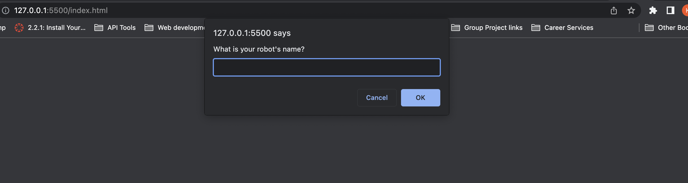

# Robot Gladiators

### This is an apllication that was designed as a ropbot battle game using input's from the user. 

### This is a robot fighting game using inout's from the user. After providing a Robot name, the game starts with three rounds. Each round fights against an enemy robot. Health is tracked after each attack. A potion can be used after eachround assuming the player's robot survives. Then an end score is given.

### badges

## Table of Contents

- [installation](#installation)
- [contribution guidelines](#contribution)
- [Test Instructions](#testing)
- [License](#license)
- [Questions](#questions)

### Installation
Installation: 
Clone Repository
git clone https://github.com/Vinyldude8896/robot-gladiators
 
#### Install Dependencies
There are no install dependecies for this project

#### run the program
Right click the index.html file and view in live server.

### Contribution Guidelines
N/A as of yet
### Testing
To test this app:
1. Clone the repo here : https://github.com/Vinyldude8896/robot-gladiators
2. Open the index.html file using live server

### Questions
    email address : kevinnivek@me.com
    - additional instructions 
    I can be contacted by phone as well, but prefer email contact first.

### Images of example readme.md

## Contribution
Made with ❤️ by Kevin Reid